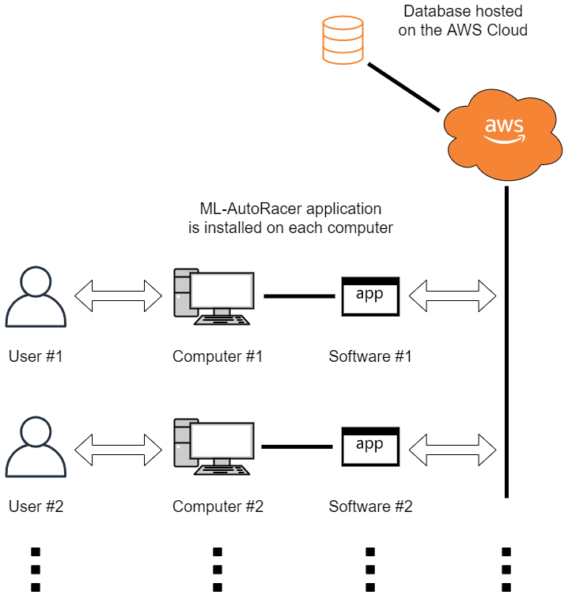
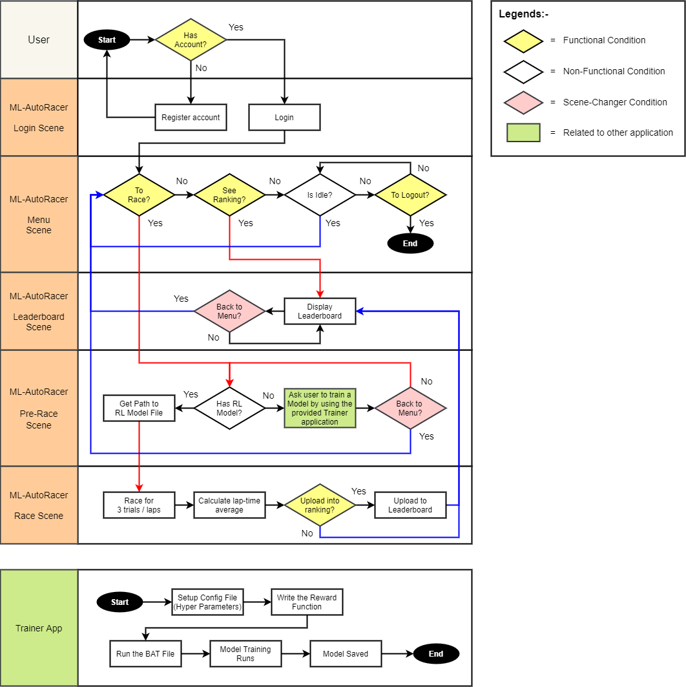
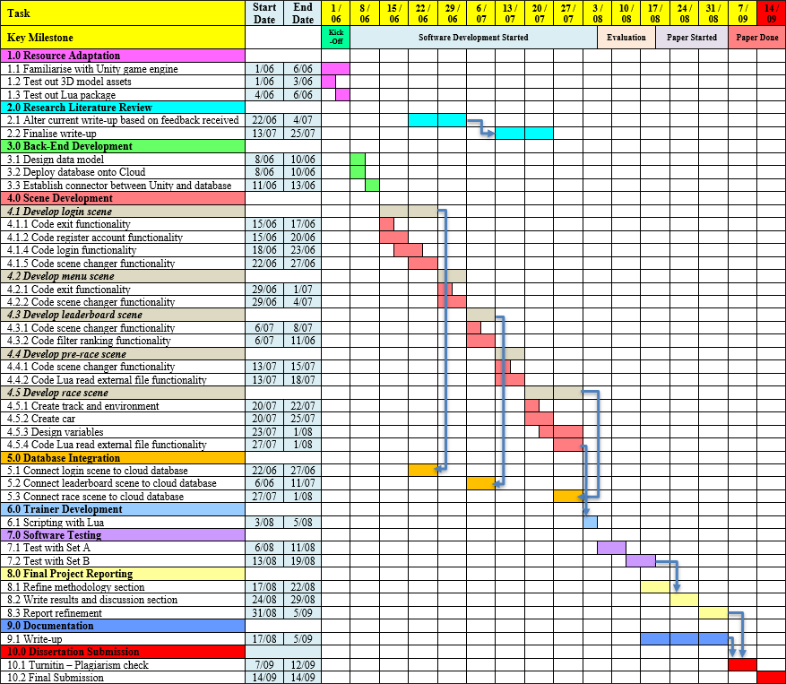

## Status: Work In Progress

    

---

## Application Review

| Login Scene - Exit        | Login Scene - Settings           | 
| ------------- |-------------| 
|       |    | 

| Login Scene - Registration Error        | Login Scene - Registration           | 
| ------------- |-------------| 
|       |    | 

## System Design and Architecture

    
  <b>Figure 1: System Architecture Overview</b>

 

## System Process Flow

    
  <b>Figure 2: System Process Flow</b>

 

## Project Timeline

    
  <b>Figure 3: Project Development Timeline</b>

